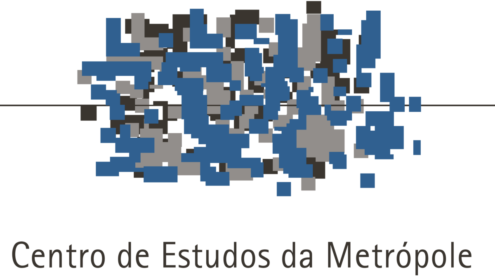

# clara

<!-- badges: start -->
[](https://www.repostatus.org/#active)
[](https://www.gnu.org/licenses/gpl-3.0)
[](https://creativecommons.org/licenses/by/4.0/)
<!-- badges: end -->

## Overview

This repository provides a fully reproducible pipeline for processing Brazilian CNPJ registries along with their geocodings using the [R programming language](https://www.r-project.org/).

You can access the pipeline [here](https://cem-usp.github.io/acessosan/).

<!-- ## Data Availability

[](https://doi.org/10.17605/OSF.IO/2UD7C)

The processed data are available in the `tif` format via a dedicated repository on the Open Science Framework ([OSF](https://osf.io/)), accessible [here](https://doi.org/10.17605/OSF.IO/2UD7C). You can also access these files directly from R using the [`osfr`](https://docs.ropensci.org/osfr/) package. -->

## Usage

The pipeline was developed using the [Quarto](https://quarto.org/) publishing system and the [R programming language](https://www.r-project.org/). To ensure consistent results, the [`renv`](https://rstudio.github.io/renv/) package is used to manage and restore the R environment.

After installing the three dependencies mentioned above, follow these steps to reproduce the analyses:

1. **Clone** this repository to your local machine.
2. **Open** the project in your preferred IDE.
3. **Restore the R environment** by running [`renv::restore()`](https://rstudio.github.io/renv/reference/restore.html) in the R console. This will install all required software dependencies.
4. **Open** `index.qmd` and run the code as described in the report.

<!-- ## How to Cite

> [!IMPORTANT]
> When using this data, you must also cite the original data sources.

To cite this work, please use the following format:

Vartanian, D., & Carvalho, A. M. (2025). *A reproducible pipeline for processing WorldClim 2.1 Historical Monthly Weather Data in Brazil* \[Computer software\]. cem-usp Research and Extension Group of the University of São Paulo. <https://cem-usp.github.io/acessosan>

A BibTeX entry for LaTeX users is

```
@misc{vartanian2025,
  title = {A reproducible pipeline for processing WorldClim 2.1 Historical Monthly Weather Data in Brazil},
  author = {{Daniel Vartanian} and {Aline Martins de Carvalho}},
  year = {2025},
  address = {São Paulo},
  institution = {cem-usp Research and Extension Group of the University of São Paulo},
  langid = {en},
  url = {https://cem-usp.github.io/acessosan}
}
``` -->

## License

[](https://www.gnu.org/licenses/gpl-3.0)
[](https://creativecommons.org/licenses/by/4.0/)

> [!IMPORTANT]
> The original data sources may have their own license terms and conditions.

The code in this repository is licensed under the [GNU General Public License Version 3](https://www.gnu.org/licenses/gpl-3.0), while the report is available under the [Creative Commons CC0 License](https://creativecommons.org/public-domain/cc0/).

``` text
Copyright (C) 2025 Clara Penz & Daniel Vartanian

The code in this repository is free software: you can redistribute it and/or
modify it under the terms of the GNU General Public License as published by the
Free Software Foundation, either version 3 of the License, or (at your option)
any later version.

This program is distributed in the hope that it will be useful, but WITHOUT ANY
WARRANTY; without even the implied warranty of MERCHANTABILITY or FITNESS FOR A
PARTICULAR PURPOSE. See the GNU General Public License for more details.

You should have received a copy of the GNU General Public License along with
this program. If not, see <https://www.gnu.org/licenses/>.
```

## Acknowledgments

<!-- {style="width: 15%;"} -->

This work is part of a research project by the Polytechnic School ([Poli](https://www.poli.usp.br/)) of the University of São Paulo ([USP](https://usp.br)), in partnership with the Secretariat for Food and Nutrition Security ([SESAN](https://www.gov.br/mds/pt-br/orgaos/SESAN)) of the Ministry of Social Development, Family, and the Fight Against Hunger ([MDS](https://www.gov.br/mds/)): *AcessoSAN: Mapping Food Access to Support Public Policies on Food and Nutrition Security and Hunger Reduction in Brazilian Cities*.

<!-- {style="width: 15%;"} -->

This work was developed with support from the Center for Metropolitan Studies ([CEM](https://centrodametropole.fflch.usp.br)) based at the School of Philosophy, Letters and Human Sciences ([FFLCH](https://www.fflch.usp.br/)) of the University of São Paulo ([USP](https://usp.br)) and at the Brazilian Center for Analysis and Planning ([CEBRAP](https://cebrap.org.br/)).

<!-- {style="width: 25%;"} -->

This study was financed, in part, by the São Paulo Research Foundation ([FAPESP](https://fapesp.br/)), Brazil. Process Number [2023/10243-0](https://bv.fapesp.br/pt/auxilios/115313/mapeamento-do-acesso-ao-alimento-para-subsidiar-politicas-publicas-de-seguranca-alimentar-e-nutricio/).

